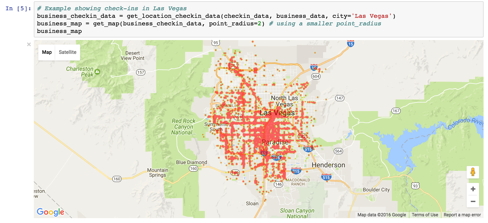
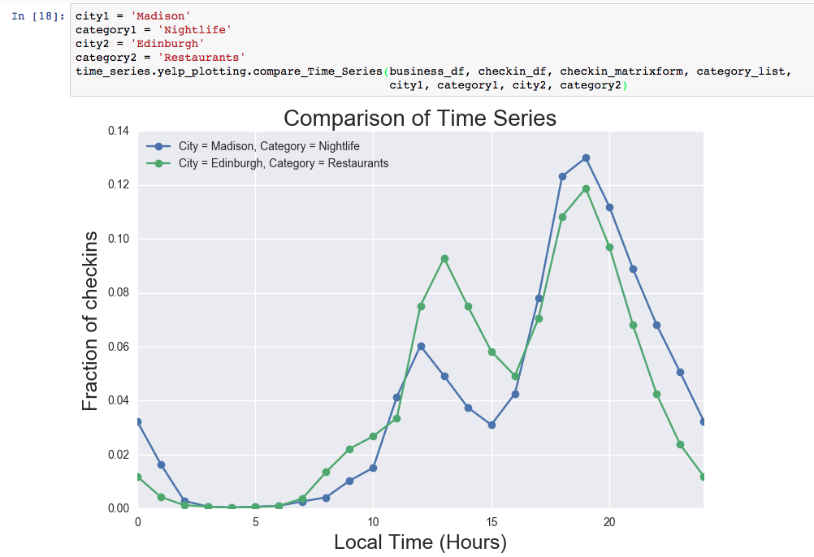
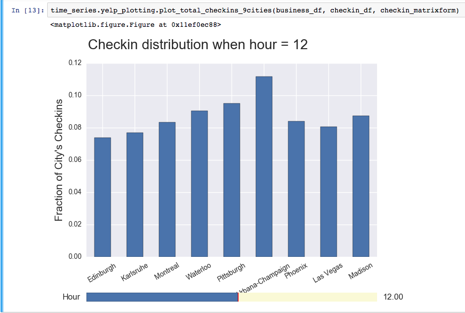
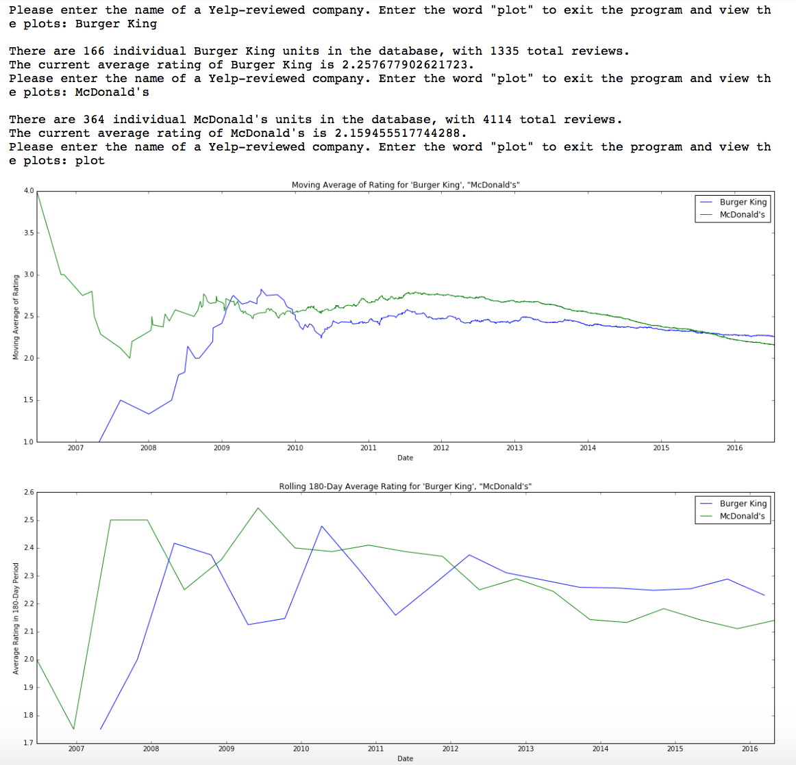
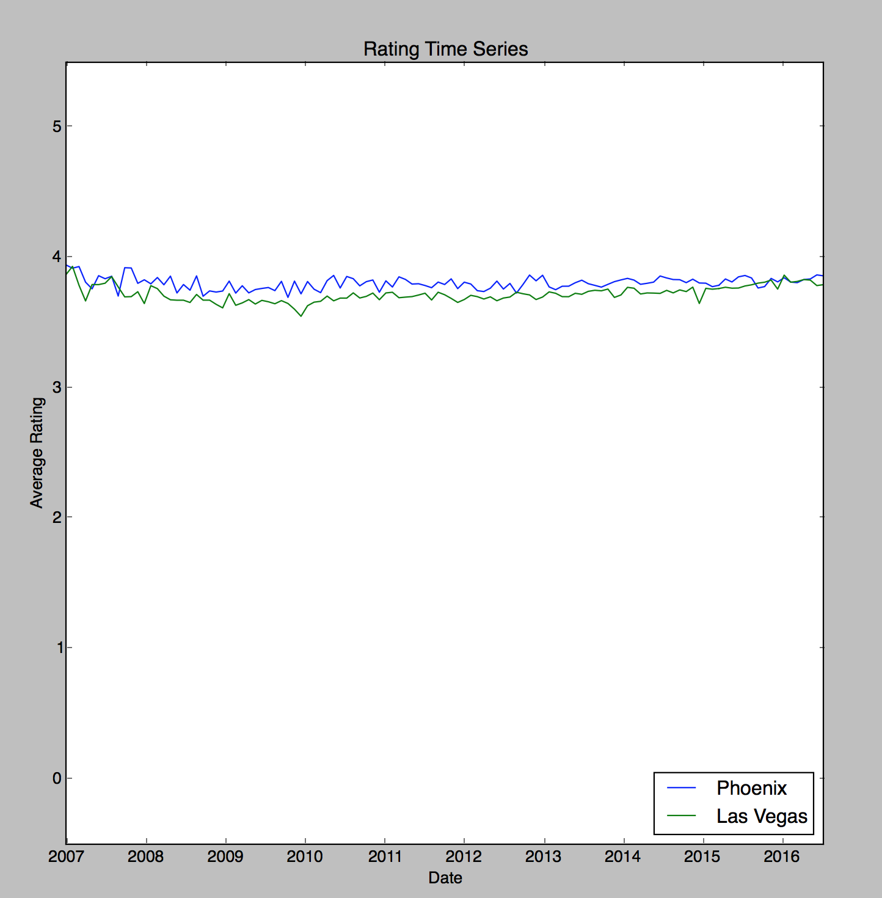

# mapping-yelp

mapping-yelp is a Python module for visualizing and analyzing the Yelp Dataset. The data contains information about business, users
and reviews. You can get more information about the Yelp dataset [here](https://www.yelp.com/dataset_challenge). mapping-yelp gives you the following functionalities:

1) Visualizing heat-maps for check-ins in different cities.

2) Generate and compare time-series of checkins-by-hour for businesses in different cities/categories. The ability to generate an interactive plot of checkins-by-hour for all cities is provided for reference.

3) Produce plots illustrating how the ratings for certain companies have changed over time.

4) Time-series analysis of average rating of different cities.

5) Predict the rating that a user will provide to a business that they visit, based on ratings they have given to other business in the past.

Installation
------------

* The module is compatible with Python-3.

* Download the dataset [here](https://drive.google.com/open?id=0B2aEMNHWCO2IaXFIUG1xcmFDWGM). The size of data is 302MB and it might take some time to download. Unzip the file to get
the data folder.

* There are a number of dependencies that you need to install and commands that you need to run for using the module:

    `$ pip install numpy`

    `$ pip install pandas`

    `$ pip install matplotlib`

    `$ pip install seaborn`

    `$ pip install ipython`

    `$ pip install -U jupyter` or `$ pip install -U jupyter --user`

    `$ pip install ipywidgets`

    `$ pip install traitlets`

    `$ pip install six`

    `$ jupyter nbextension enable --py --sys-prefix widgetsnbextension`

    `$ pip install gmaps`

    `$ jupyter nbextension enable --py gmaps`

* If you are unable to use the module even after installing the dependencies and running the above commands, please check that the version number of below packages satisfy the below requirements:

    - ipython >= 4.2.0, to upgrade use: `$ pip install ipython --upgrade`

    - ipywidgets >= 5.2.2, to upgrade use: `$ pip install ipywidgets --upgrade`

    - traitlets >= 4.3.0, to upgrade use: `$ pip install traitlets --upgrade`

Usage
------------

Examples for the different visualizations are present inside the examples folder. For running the examples you should download and unzip the data. The folder for data should be placed just under the 'mapping-yelp/' directory (on the same level as 'src/' and 'examples/' directory). Ideally the examples should be run from inside
the examples directory. Refer to the files for specific examples for more
details.

The code for modules is present inside the 'src/' folder.

1) Visualizing heat-maps for check-ins in different cities:
A demo of this example is present at 'examples/checkins_map_notebook.ipynb'.
Refer to the docstring in notebook for more details.

2) Generate and compare time-series of checkins-by-hour for businesses:
Demos for this are present at 'examples/time_series_example.py' and
'examples/inspect_checkins.py'. Refer to the docstrings in examples for
more details. The first run of these examples takes roughly 10 minutes. The
subsequent runs take around a minute to run.

3) Produce plots illustrating how the ratings for certain companies have changed over time: A demo for this example is present at 'examples/company_rating_example.py'. Refer to the docstring in example for
more details.

4) Time-series analysis of average rating of different cities: A demo of this
example is present at 'examples/average_rating_example.py'. Refer to the
docstring in example for more details.

5) Predict the rating that a user will provide to a business: A demo of this
example is present at 'examples/linear_regression_example.py'. Refer to the
docstring in example for more details. After running the example you get
the root-mean-square-error (rmse) for the predicted ratings.

Tests
------------
For running the tests use the command 'python -m unittest discover'. There are
10 tests which take around 50 seconds to run. Refer to '__init__.py' for more instructions on how to run tests. The tests should be run from outside the 'tests' directory (just inside the 'mapping-yelp' directory).
